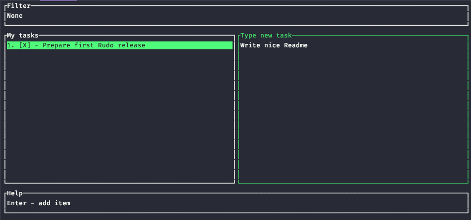

<!-- PROJECT LOGO -->
 

  <h3 align="center">Rudo</h3>

  

    A geeky terminal todo app
     
     
    <a href="https://github.com/GlebIrovich/rudo/issues">Report Bug</a>
    ·
    <a href="https://github.com/GlebIrovich/rudo/issues">Request Feature</a>
  

<!-- TABLE OF CONTENTS -->

  
Table of Contents

  <ol>
    <li>
      <a href="#about-the-project">About The Project</a>
      <ul>
        <li><a href="#built-with">Built With</a></li>
      </ul>
    </li>
    <li>
      <a href="#getting-started">Getting Started</a>
    </li>
    <li><a href="#usage">Usage</a></li>
    <li><a href="#license">License</a></li>
    <li><a href="#contact">Contact</a></li>
  </ol>

<!-- ABOUT THE PROJECT -->
## About The Project

**Rudo** (from **Rust** + **todo**) is an attempt of transformimg developers' primary tool, terminal, to a feature
reach application. When starting that project, I was challenged to create UX experience which can be compared
to the one we are used to on the web. On the other hand, as a fan of geeky things I was looking for a simple
terminal utility, that I can use to manage simple to-do lists.

### Built With

* [Rust](https://www.rust-lang.org/)
* [tui-rs](https://github.com/fdehau/tui-rs)

<!-- GETTING STARTED -->
## Getting Started

Currently, application is only supported by MacOS and Linux

1. Go to the Rudo latest [release](https://github.com/GlebIrovich/rudo/releases)
1. Download binaries for you OS
1. Add an alias fot the script `alias rudo="PATH/TO/SCRIPT"`

<!-- USAGE EXAMPLES -->
## Usage

Now you are good to go. Invoke Rudo in your terminal: `rudo`

<!-- LICENSE -->
## License

Distributed under the MIT License. See `LICENSE` for more information.

<!-- CONTACT -->
## Contact

Gleb Irovich - [Twitter](https://twitter.com/gleb_irovich) | [DEV.to](https://dev.to/glebirovich)

Project Link: [https://github.com/GlebIrovich/rudo](https://github.com/GlebIrovich/rudo)